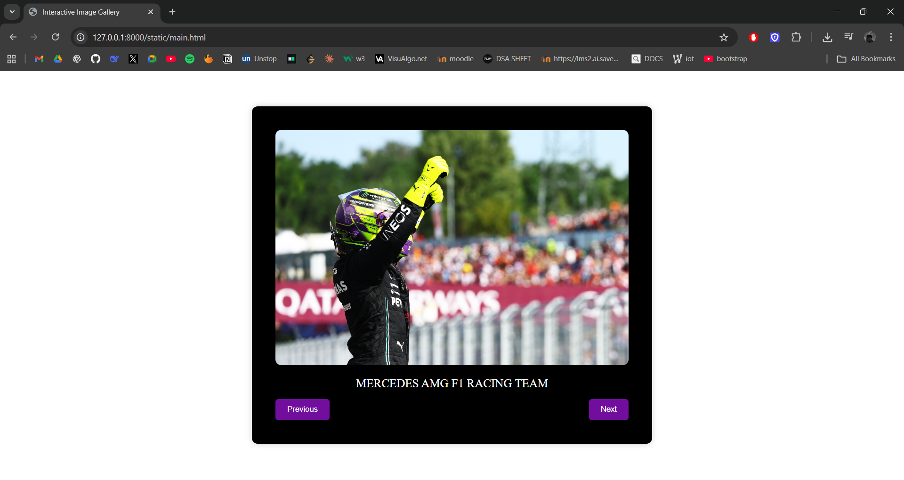
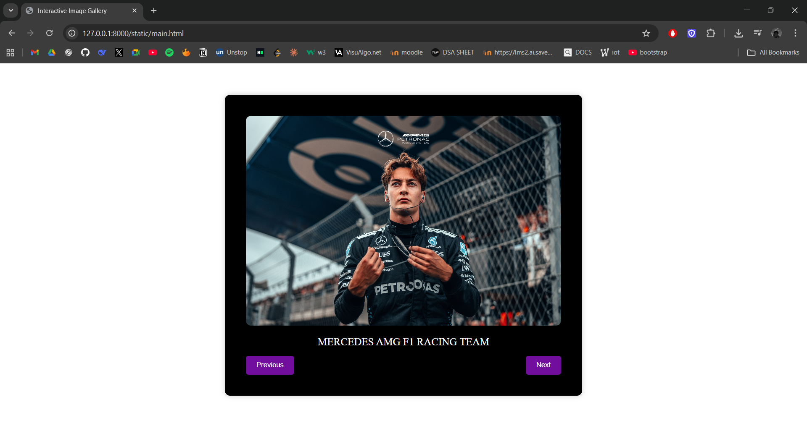
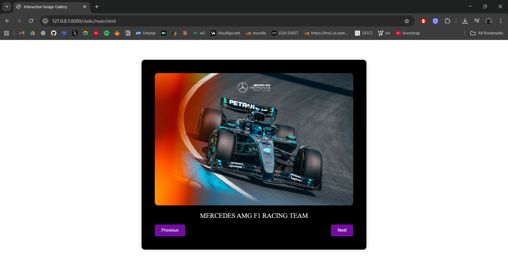
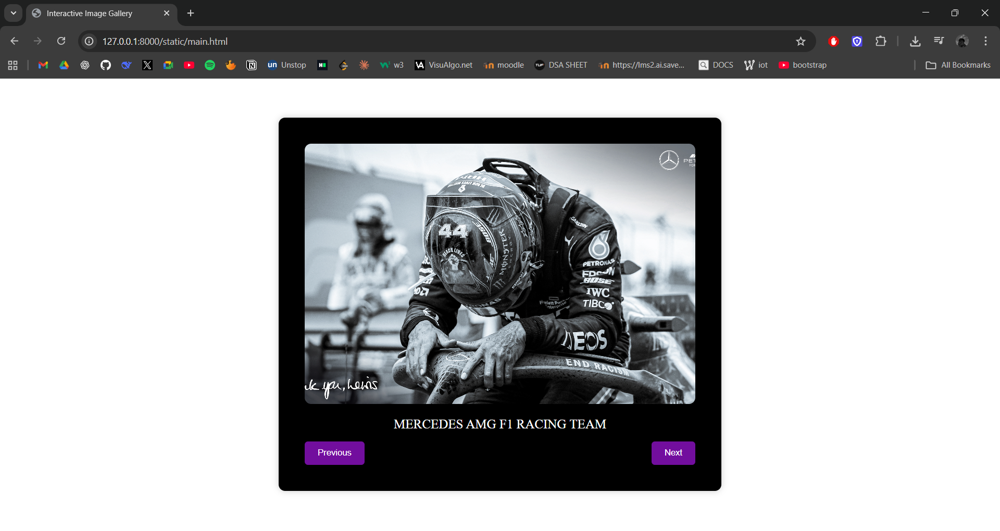
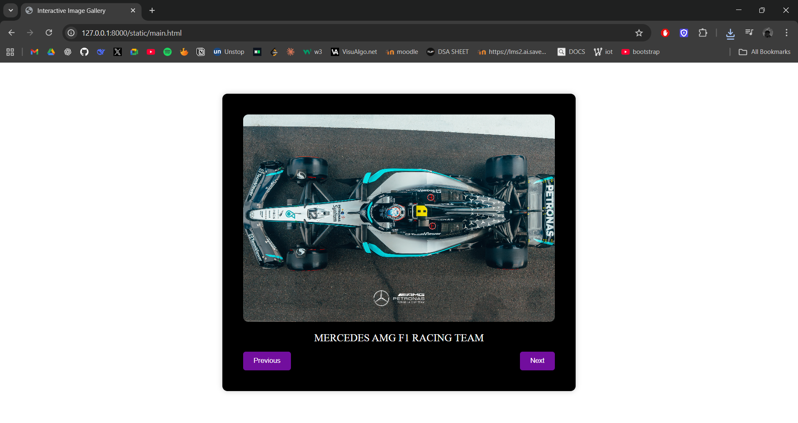

# Ex.08 Design of Interactive Image Gallery
# Date:08.10.2025
# AIM:
To design a web application for an inteactive image gallery with minimum five images.

# DESIGN STEPS:
## Step 1:
Clone the github repository and create Django admin interface.

## Step 2:
Change settings.py file to allow request from all hosts.

## Step 3:
Use CSS for positioning and styling.

## Step 4:
Write JavaScript program for implementing interactivity.

## Step 5:
Validate the HTML and CSS code.

## Step 6:
Publish the website in the given URL.

# PROGRAM :
```
<html>

<head>
    <title>Interactive Image Gallery</title>
    <style>
        .gallery-container {
            position: relative;
            max-width: 600px;
            margin: auto;
            background: black;
            padding: 40px;
            border-radius: 10px;
            box-shadow: 0 0 10px rgba(0, 0, 0, 0.2);
            margin: 0 auto;
            margin-top: 60px;
        }

        .gallery-image {
            width: 100%;
            height: 400px;
            object-fit: cover;
            border-radius: 10px;
        }

        .caption {
            margin-top: 20px;
            font-size: 20px;
            text-align: center;
            color: white;
        }

        .gallery-buttons {
            display: flex;
            justify-content: space-between;
            margin-top: 15px;
        }

        button {
            padding: 10px 20px;
            cursor: pointer;
            border: none;
            border-radius: 5px;
            background-color: #720e9e;
            color: white;
            transition: 0.3s;
        }

    </style>
</head>

<body>
    <div class="gallery-container">
        
        <div id="caption" class="caption">  MERCEDES AMG F1 RACING TEAM</div>
        <div class="gallery-buttons">
            <button onclick="prevImage()">Previous</button>
            <button onclick="nextImage()">Next</button>
        </div>
    </div>

    <script>
        const images = [
            { src: "1.jpg", caption: "  MERCEDES AMG F1 RACING TEAM" },
            { src: "2.jpg", caption: "  MERCEDES AMG F1 RACING TEAM" },
            { src: "3.jpg", caption: "  MERCEDES AMG F1 RACING TEAM" },
            { src: "4.jpg", caption: "  MERCEDES AMG F1 RACING TEAM" }
        ];
        let currentIndex = 0;

        function updateGallery() {
            document.getElementById("galleryImage").src = images[currentIndex].src;
            document.getElementById("caption").textContent = images[currentIndex].caption;
        }

        function nextImage() {
            currentIndex = (currentIndex + 1) % images.length;
            updateGallery();
        }

        function prevImage() {
            currentIndex = (currentIndex - 1 + images.length) % images.length;
            updateGallery();
        }

    </script>
</body>

</html>

```
# OUTPUT:







# RESULT:
The program for designing an interactive image gallery using HTML, CSS and JavaScript is executed successfully.
